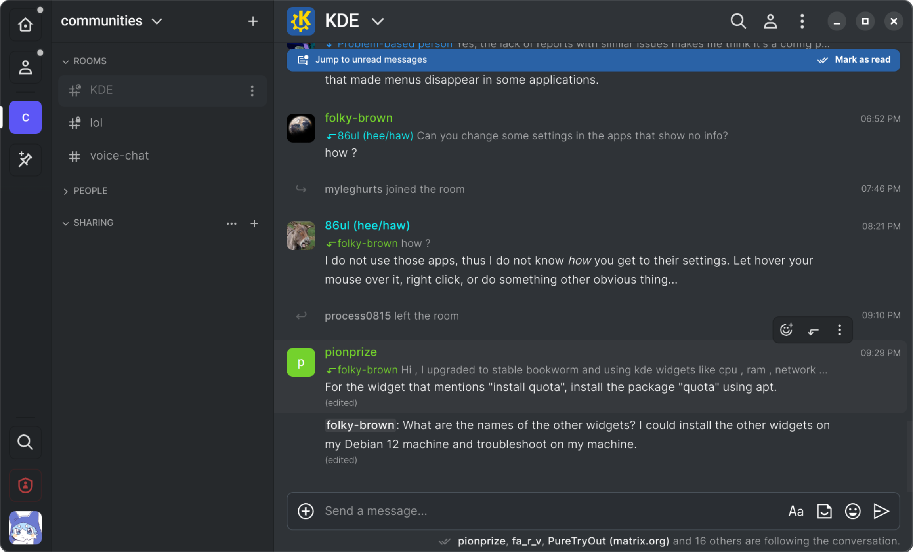

# Cinny in Nativefier



A set of patches to make Cinny in Nativefier more nice.

**Why?** The desktop app Cinny ships is built from releases, whereas I wanted to use the code from `master` branch, and also I wanted to have a native experience without having to use browser to access `https://dev.cinny.in`

This patchset makes Cinny look more coherent on GNOME Wayland desktops.

#### Modifications
- Using a frameless transparent window with rounded corners and GNOME-styled window buttons
- Higher-quality app and tray icons
- Shipped `.desktop` file

### Usage
Install `nativefier` if you haven't yet: `npm install -g nativefier`

Create a new Nativefier app somewhere:
```bash
$ nativefier https://dev.cinny.in -e 25.2.0 --tray --single-instance --browserwindow-options '{ "transparent": true, "webPreferences": { "sandbox": false } }' --hide-window-frame
```
By default, Nativefier used Electron v19 instead of latest, so I specified version `25.2.0`, see Electron releases at https://github.com/electron/electron/releases

Copy `cinny-nativefier-main.patch` to the directory `Cinny-linux-x64/` that was created by Nativefier.

Apply patches from `cinny-nativefier-main.patch`:
```bash
Cinny-linux-x64/ $ patch -p0 < ./cinny-nativefier-main.patch
```

Copy and replace `icon.png`, `icon.svg` and `tray.png` in the `Cinny-linux-x64/resources/app/` folder.

Copy files from `inject/` in the `Cinny-linux-x64/resources/app/inject/` folder.

Copy `Cinny.desktop` to `~/.local/share/applications` and make the following edits:
- Replace `path-to-dir` with where you deployed Cinny Nativefier app (`Cinny-linux-x64/`)
- Change StartupWMClass property to the value in the name `field` in `Cinny-linux-x64/resources/app/package.json`
